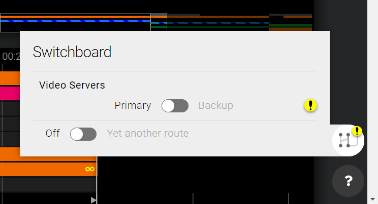

# Features


Reading tip: [Concepts & Architecture](features-and-configuration/concepts-and-architecture.md)


## Lobby


Documentation for this section is yet to be written.


In the lobby, all existing rundowns are listed.

## Rundown View


Documentation for this section is yet to be written.


The Rundown View is the main view that the producer is working in.

Things that should be covered: 

* What are all the labels, countdowns, colors, signs etc?

#### Segment Header countdowns



Clock on the left is an indicator of how much time has been spent playing Parts from that Segment in relation to how much time was planned for Parts in that Segment. If more time was spent playing than was planned for, this clock will turn red, there will be a **+** sign in front of it and will begin counting upwards.



Clock on the right is a countdown to the beginning of a given segment. This takes into account unplayed time in the On Air Part and all unplayed Parts between the On Air Part and a given Segment. If there are no unplayed Parts between the On Air Part and the Segment, this counter will disappear.



In the illustration above, the first Segment \(_Ny Sak_\) has been playing for 4 minutes and 25 seconds longer than it was planned for. The second segment \(_Direkte Strømstad\)_ is planned to play for 4 minutes and 40 seconds. There are 5 minutes and 46 seconds worth of content between the current On Air line \(which is in the first Segment\) and the second Segment.

#### Rundown dividers

When using a workflow and blueprints that combine multiple NRCS Rundowns into a single Sofie Rundown \(such as when using the "Ready To Air" functionality in AP ENPS\), information about these individual NRCS Rundowns will be inserted into the Rundown View at the point where each of these incoming Rundowns start.

For reference, these headers show the Name, Planned Start and Planned Duration of the individual NRCS Rundown.

### Shelf

The shelf contains lists of AdLibs that can be played out.


The Shelf can be opened by clicking the handle at the bottom of the screen, or by pressing the TAB key


### Side panel

#### Notification center


Documentation for this section is yet to be written.


#### Switchboard

The Switchboard allows the producer to turn automation _On_ and _Off_ for sets of devices, as well as re-route automation control between devices - both with an active rundown and when no rundown is active in a [Studio](features-and-configuration/concepts-and-architecture.md#system-organization-studio-and-show-style).

The Switchboard panel can be accessed from the Rundown View's right-hand Toolbar, by clicking on the Switchboard button, next to the Support panel button.


Technically, the switchboard activates and deactivates Route Sets. The Route Sets are grouped by Exclusivity Group. If an Exclusivity Group contains exactly two elements with the `ACTIVATE_ONLY` mode, the Route Sets will be displayed on either side of the switch. Otherwise, they will be displayed separately in a list next to an _Off_ position. See also [Settings ● Route sets](features-and-configuration/settings-view.md#route-sets).


### Playing things

#### Take Point

The Take point is currently playing [Part](dictionary.md#part) in the rundown, indicated by the "On Air" line in the GUI.  
What's played on air is calculated from the timeline objects in the Pieces in the currently playing part.

The Pieces inside of a Part determines what's going to happen, the could be indicating things like VT:s, cut to cameras, graphics, or what script the host is going to read.


You can TAKE the next [Part](dictionary.md#part) by pressing F12 or the Numpad Enter key.


#### Next Point

The Next point is the next queued Part in the rundown. When the user clicks _Take_, the Next Part becomes the currently playing part, and the Next point is also moved.


Change the Next point by right-clicking in the GUI, or by pressing \(Shift +\) F9 & F10.


#### Lookahead

Elements in the [Next point ](dictionary.md#next-point)\(or beyond\) might be pre-loaded or "put on preview", depending on the blueprints and play-out devices used. This feature is called "Lookahead".

## Additional views

Sofie features a few separate views, such as the prompter, [read about them here](features-and-configuration/sofie-pages.md).

