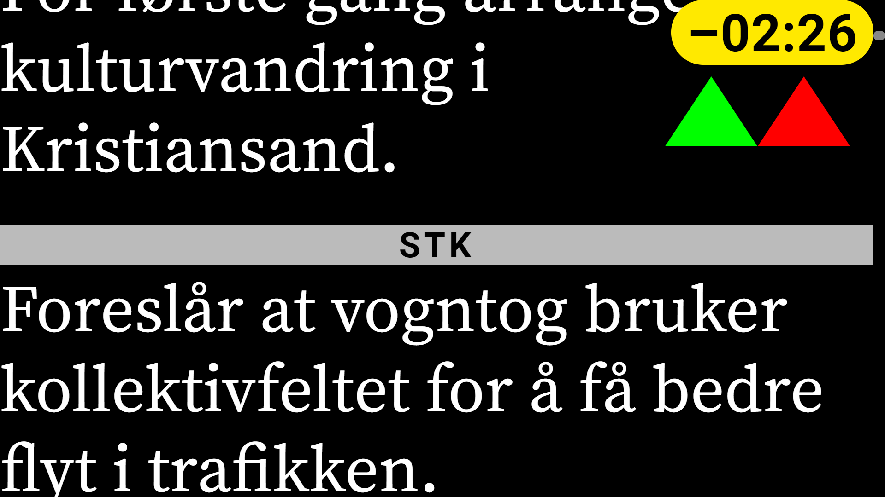

# Prompter

See [Sofie views](sofie-pages.md#prompter) for how to access the prompter page.

The prompter will display the script for the Rundown currently active in the Studio. On Air and Next parts and segments are highlighted - in red and green, respectively - to aid in navigation. In top-right corner of the screen, a Diff clock is shown, showing the difference between planned playback and what has been actually produced. This allows the host to know how far behind/ahead they are in regards to planned execution.

If the user scrolls the prompter ahead or behind the On Air part, helpful indicators will be shown in the right-hand side of the screen. If the On Air or Next part's script is above the current viewport, arrows pointing up will be shown. If the On Air part's script is below the current viewport, a single arrow pointing down will be shown.

## Customize looks

The prompter UI can be configured using query parameters:

| Query parameter | Type | Description | Default |
| :--- | :--- | :--- | :--- |
| `mirror` | string | Mirror the display horizontally |  |
| `vmirror` | string | Mirror the display vertically |  |
| `fontsize` | number | Set a custom font size of the text. 20 will fit in 5 lines of text, 14 will fit 7 lines etc.. | `14` |
| `marker` | string | Set position of the read-marker. Possible values: "center", "top", "bottom", "hide" | `hide` |
| `margin` | number | Set margin of screen \(used on monitors with overscan\), in %. | `0` |
| `showmarker` | 0 / 1 | If the marker is not set to "hide", control if the marker is hidden or not | `1` |
| `showscroll` | 0 / 1 | Whether the scroll bar should be shown | `1` |
| `followtake` | 0 / 1 | Whether the prompter should automatically scroll to current segment when the operator TAKE:s it | `1` |

Example: [http://mySofie/prompter/studio0/?mode=mouse&followTake=0&fontsize=20](http://mysofie/prompter/studio0/?mode=mouse&followTake=0&fontsize=20)

## Controlling the prompter

The prompter can be controlled by different types of controllers. Which mode is set by the query parameter, like so: `?mode=mouse`.

| Query parameter | Description |
| :--- | :--- |
| Default | Controlled by both mouse and keyboard |
| `?mode=mouse` | Controlled by mouse only |
| `?mode=keyboard` | Controlled by keyboard only |
| `?mode=shuttlekeyboard` | Controlled by a Contour Design ShuttleXpress, X-keys Jog and Shuttle or compatible, configured as keyboard-inputs \(see below\) |

#### Control using mouse \(scroll wheel\)

The prompter can be controlled in multiple ways when using the scroll wheel:

| Query parameter | Description |
| :--- | :--- |
| `?controlmode=normal` | Scrolling of the mouse works as "normal scrolling" |
| `?controlmode=speed` | Scrolling of the mouse changes the speed of scolling. Left-click to toggle, right-click to rewind |
| `?controlmode=smoothscroll` | Scrolling the mouse wheel starts continous scrolling. Small speed adjustments can then be made by nudging the scroll wheel. Stop the scrolling by making a "larger scroll" on the wheel. |

has several operating modes, described further below. All modes are intended to be controlled by a computer mouse or similar, such as a presenter tool.

#### Control using keyboard

Keyboard control is intended to be used when having a "keyboard"-device, such as a presenter tool.

| Scroll up | Scroll down |
| :--- | :--- |
| `Arrow Up` | `Arrow Down` |
| `Arrow Left` | `Arrow Right` |
| `Page Up` | `Page Down` |
|  | `Space` |

#### Control using Contour ShuttleXpress or X-keys

This mode is intended to be used when having a Contour ShuttleXpress or X-keys device, configured to work as a keyboard device.

| Key combination | Function |
| :--- | :--- |
| `Ctrl` `Alt` `F1` ... `Ctrl` `Alt` `F7` | Set speed to +1 ... +7 \(Scroll down\) |
| `Ctrl` `Shift` `Alt` `F1` ... `Ctrl` `Shift` `Alt` `F7` | Set speed to -1 ... -7 \(Scroll up\) |
| `Ctrl` `Alt` `+` | Increase speed |
| `Ctrl` `Alt` `-` | Decrease speed |
| `Ctrl` `Alt` `Shift` `F8`, `Ctrl` `Alt` `Shift` `PageDown` | Jump to next Segment and stop |
| `Ctrl` `Alt` `Shift` `F9`, `Ctrl` `Alt` `Shift` `PageUp` | Jump to previous Segment and stop |
| `Ctrl` `Alt` `Shift` `F10` | Jump to top of Script and stop |
| `Ctrl` `Alt` `Shift` `F11` | Jump to Live and stop |
| `Ctrl` `Alt` `Shift` `F12` | Jump to next Segment and stop |

Configuration files that can be used in their respective driver software:

* [Contour ShuttleXpress](https://github.com/nrkno/tv-automation-server-core/blob/release26/resources/prompter_layout_shuttlexpress.pref)
* [X-keys](https://github.com/nrkno/tv-automation-server-core/blob/release26/resources/prompter_layout_xkeys.mw3)

