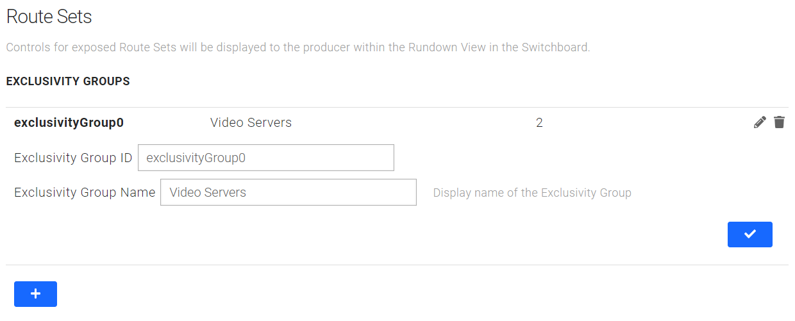

# Settings


The settings pages are only visible to users with the right [access level](sofie-navigation.md)!


Recommended read before diving into the settings: [System, \(Organization\), Studio & Show Style](concepts-and-architecture.md#system-organization-studio-and-show-style).

## System

The _System_ settings are settings for this installation of Sofie. In here goes the settings that are applicable system-wide.


Documentation for this section is yet to be written.


## Studio

A _Studio_ in Sofie-terms is a physical location, with a specific set of devices and equipment. Only one show can be on air in a studio at the same time.  
The _studio_ settings are settings for that specific studio, and contains settings related to hardware and play-out, such as:

* **Attached devices** - the Gateways related to this studio
* **Blueprint configuration** - ****custom config option defined by the blueprints
* **Layer Mappings** - Maps the logical _timeline layers_ to physical devices and outputs

The Studio uses a studio-blueprint, which handles things like mapping up an incoming rundown to a Showstyle.

### Attached devices

This section allows you to add and remove Gateways that are related to this _Studio_. When a Gateway is attached to a Studio, it will react to the changes happening within it, as well as feed the neccessary data into it.

### Blueprint configuration

Sofie allows the Blueprints to expose custom configuration fields that allow the System Administrator to reconfigure how these Blueprints work through the Sofie UI. Here you can change the configuration of the [Studio Blueprint](concepts-and-architecture.md#studio-blueprints).

### Layer Mappings

This section allows you to add, remove and configure how logical device-control will be translated to physical automation control. [Blueprints](concepts-and-architecture.md#blueprints) control devices through objects placed on a [Timeline](concepts-and-architecture.md#timeline) using logical device identifiers called _Layers_. A layer represents a single aspect of a device that can be controlled at a given time: a video switcher's M/E bus, an audio mixers's fader, an OSC control node, a video server's output channel. Layer Mappings translate these logical identifiers into physical device aspects, for example:

This _Layer Mapping_ configures the `atem_me_program` Timeline-layer to control the `atem0` device of the `ATEM` type. No Lookahead will be enabled for this layer. This layer will control a `MixEffect` aspect with the Index of `0` \(so M/E 1 Bus\).

These mappings allow the System Administrator to reconfigure what devices the Blueprints will control, without the need of changing the Blueprint code.

#### Route Sets

In order to allow the Producer to reconfigure the automation from the Switchboard in the [Rundown View](../dictionary.md#rundown-view), as well as have some pre-set automation control available for the System Administrator, Sofie has a concept of Route Sets. Route Sets work on top of the Layer Mappings, by configuring sets of [Layer Mappings](settings-view.md#layer-mappings) that will re-route the control from one device to another, or to disable the automation altogether. These Route Sets are presented to the Producer in the [Switchboard ](../dictionary.md#switchboard)panel.

A Route Set is essentially a distinct set of Layer Mappings, which can modify the settings already configured by the Layer Mappings, but can be turned On and Off. Called Routes, these can change:

* the Layer ID to a new Layer ID
* change the Device being controlled by the Layer
* change the aspect of the Device that's being controlled.

Route Sets can be grouped into Exclusivity Groups, in which only a single Route Set can be enabled at a time. When activating a Route Set within an Exclusivity Group, all other Route Sets in that group will be deactivated. This in turn, allows the System Administrator to create entire sections of exclusive automation control within the Studio that the Producer can then switch between. One such example could be switching between Primary and Backup playout servers, or switching between Primary and Backup talent microphone.

A Route Set has a Behavior property which will dictate what happens how the Route Set operates:

| Type | Behavior |
| :--- | :--- |
| `ACTIVATE_ONLY` | This RouteSet cannot be deactivated, only a different RouteSet in the same Exclusivity Group can cause it to deactivate |
| `TOGGLE` | The RouteSet can be activated and deactivated. As a result, it's possible for the Exclusivity Group to have no Route Set active |
| `HIDDEN` | The RouteSet can be activated and deactivated, but it will not be presented to the user in the Switchboard panel |

Route Sets can also be configured with a _Default State_. This can be used to contrast a normal, day-to-day configuration with an exceptional one \(like using a backup device\) in the [Switchboard ](../dictionary.md#switchboard)panel.

| Default State | Behavior |
| :--- | :--- |
| Active | If the Route Set is not active, an indicator will be shown |
| Not Active | If the Route Set is active, an indicator will be shown |
| Not defined | No indicator will be shown, regardless of the Route Set state |

## Show style

A _Showstyle_ is related to the looks and logic of a _show_, which in contrast to the _studio_ is not directly related to the hardware.  
The Showstyle contains settings like

* **Source Layers -** Groups different types of content in the GUI
* **Output Channels** - Indicates different output targets \(such as the _Program_ or _back-screen in the studio_\)
* **Blueprint configuration** - ****custom config option defined by the blueprints


Please note the difference between S_ource Layers_ and _timeline-layers:_

[Pieces ](../dictionary.md#piece)are put onto _Source layers_, to group different types of content \(such as a VT or Camera\), they are therefore intended only as something to indicate to the user what is going to be played, not what is actually going to happen on the technical level.

[Timeline-objects](../dictionary.md#timeline-object) \(inside of the [Pieces](../dictionary.md#piece)\) are put onto timeline-layers, which are \(through the Mappings in the studio\) mapped to physical devices and outputs.  
The exact timeline-layer is never exposed to the user, but instead used on the technical level to control play-out.

An example of the difference could be when playing a VT \(that's a Source Layer\), which could involve all of the timeline-layers _video\_player0_, _audio\_fader\_video_, _audio\_fader\_host_ and _mixer\_pgm._


## Migrations

The migrations are automatic setup-scripts that help you during initial setup and system upgrades.

There are system-migrations that comes directly from the version of Sofie Core you're running, and there are also migrations added by the different blueprints.

It is mandatory to run migrations when you've upgraded Sofie Core to a new version, or upgraded your blueprints.

