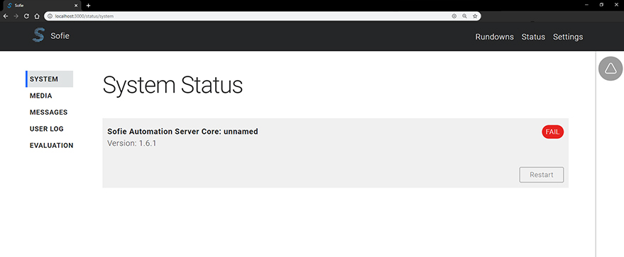
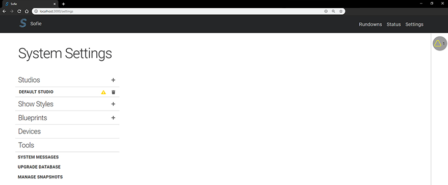

# Getting Started

_Sofie_ can be installed in many different ways, depending on which platforms, needs, and features you desire. If this is your first time working with _Sofie_, it is recommend to start with the [Installation and Setup](../installation/) portion of this guide. It will walk you through all the required steps to get _Sofie_ running on your local machine as well as provide the resources to attach additional hardware \(vision mixers, audio mixes, etcetera\) if necessary. 

## Sofie Core Pages

The _Rundowns_ page will display all the active rundowns that the _Sofie Core_ has access to. 

The _Status_ pages displays the current status for the attached devices and gateways.

The _Settings_ pages contains various settings for the studio, show styles, blueprints etc.. If the link to the settings page is not visible in your application, review the [Sofie Access Levels](sofie-navigation.md) portion of this guide. More info on specific parts of the _Settings_ page can be found in their corresponding guide sections. 

## Sofie Core Overview

The _Sofie_ _Core_ is the primary application for managing the broadcast but, it doesn't play anything out on it's own. You need to use Gateways to establish the connection from the core to other pieces of hardware or remote software. 

### Gateways

Gateways are separate applications that bridge the gap between the _Sofie Core_ and other pieces of hardware or services. At minimum, you will need a _Playout Gateway_ so your timeline can interact with your playout system of choice. To install the _Playout Gateway_, visit the [Installing a Gateway](../installation/installing-a-gateway/) section of this guide and for a more in-depth look, please visit the [Under the Hood section – Gateways](../under-the-hood/dictionary.md#gateways). 

### Blueprints

Blueprints can be described as the logic that determines how a studio and show should interact with one another. They interpret the data coming in from the rundowns and transform them into a rich set of playable elements \(_Segments_, _Parts_, _AdLibs,_ etcetera\). The _Sofie Core_ has three main blueprint types, _System Blueprints_, _Studio Blueprints_, and _Showstyle Blueprints_. Installing _Sofie_ does not require you understand what these blueprints do, just that they are required for the _Core_ to work. If you would like to gain a deeper understand of how _Blueprints_ work, please visit the [Under The Hood – Blueprints](../under-the-hood/dictionary.md#blueprints) section.

## Further Reading

* [Installation & Setup](../installation/)
* [Under the Hood \(for developers\)](../under-the-hood/)

