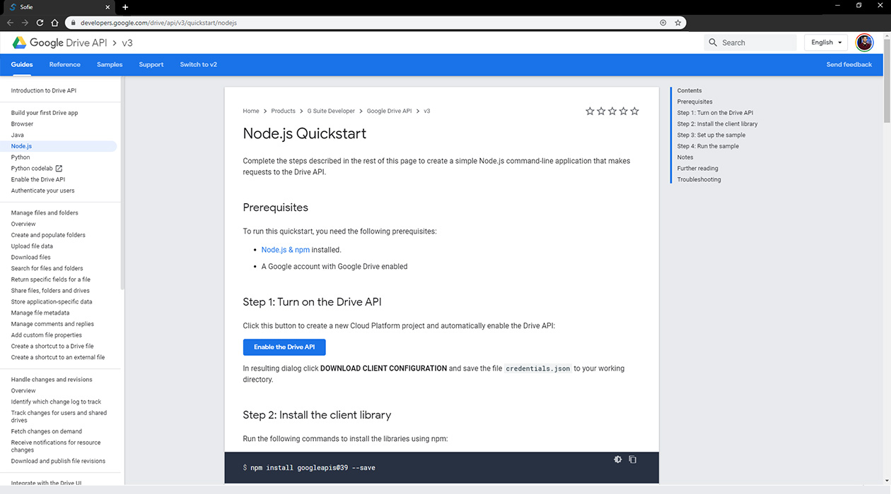
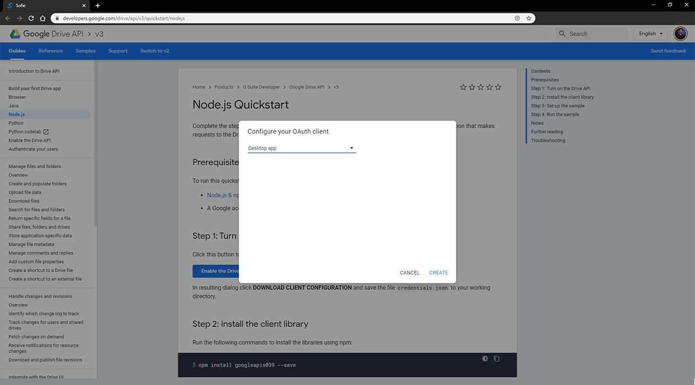
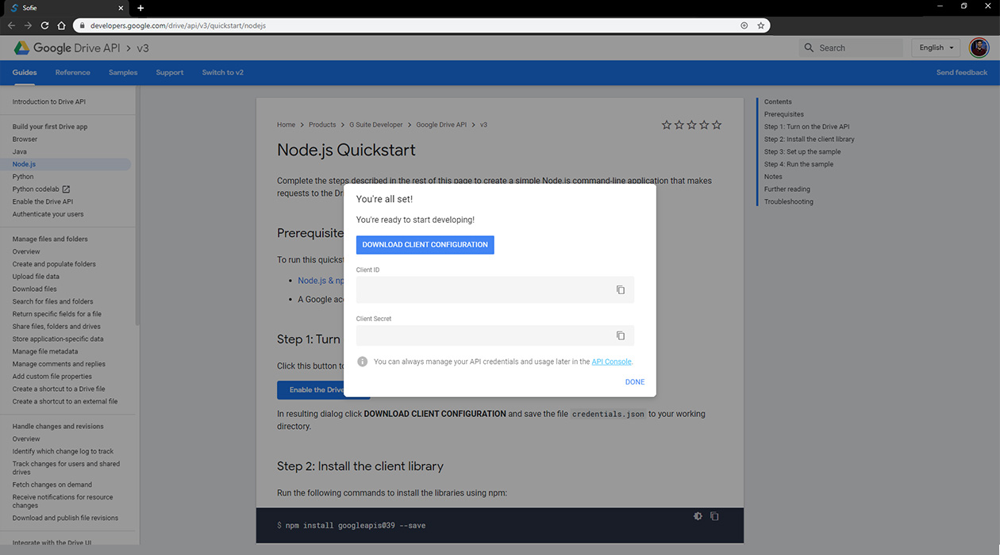

# Google Spreadsheet Gateway

The Spreadsheet Gateway is an application for piping data between Sofie Core and Spreadsheets on Google Drive.

### Example Blueprints for Spreadsheet Gateway

To begin with, you will need to install a set of Blueprints that can handle the data being sent from the _Gateway_ to _Core_. Download the ZIP file containing the three files you need from the [Spreadsheet Gateway's GitHub Repository](https://github.com/SuperFlyTV/sofie-blueprints-spreadsheet/releases). It is recommended to choose the newest release but, an older _Core_ version may require a different Blueprint version. The _Rundown page_ will warn you about any issue and display the desired versions. 

Instructions on how to install any Blueprint can be found in the [Installing Blueprints](../../installing-blueprints.md) section from earlier. 

### Spreadsheet Gateway Configuration

If you are using the Docker version of Sofie, then the Spreadsheet Gateway will come preinstalled. For those who are not, please follow the [instructions listed on the GitHub page](https://github.com/SuperFlyTV/sofie-blueprints-spreadsheet) labeled _Installation \(for developers\)._

Once the Gateway has been installed, you can navigate to the _Settings page_ and check the newly added Gateway is listed as _Spreadsheet Gateway_ under the _Devices section_. 

Before you select the Device, you want to add it to the current _Studio_ you are using. Select your current Studio from the menu and navigate to the _Attached Devices_ option. Click the _+_ icon and select the Spreadsheet Gateway.

Now you can select the _Device_ from the _Devices menu_ and click the link provided to enable your Google Drive API to send files to the _Sofie Core_. The page that opens will look similar to the image below.

Next click the button labeled _Enable the Drive API_ and a popup window will open.

In the drop down menu, select _Desktop app_ and then you can click the _Create_ button to move to the next page.

On the second page in the popup window you are presented with your client ID and secret. Use the button to download the configuration to a file and navigate back to _Sofie Core's Settings page_. Select the Spreadsheet Gateway, then click the _Browse_ button and upload the configuration file you just downloaded. A new link will appear to confirm access to your google drive account. Select the link and in the new window, select the Google account you would like to use. Currently, the Sofie Core Application is not verified with Google so you will need to acknowledge this and proceed passed the unverified page. Click the _Advanced_ button and then click _Go to QuickStart \( Unsafe \)_. 

After navigating through the prompts you are presented with your verification code. Copy this code into the input field on the _Settings page_ and the field should be removed. A message confirming the access token was saved will appear.

You can now navigate to your Google Drive account and create a new folder for your rundowns. It is important that this folder has a unique name. Next, navigate back to _Sofie Core's Settings page_ and add the folder name to the appropriate input.

The indicator should now read _Good, Watching folder 'Folder Name Here'_. Now you just need an example rundown.[ Navigate to this Google Sheets file](https://docs.google.com/spreadsheets/d/1iyegRv5MxYYtlVu8uEEMkBYXsLL-71PAMrNW0ZfWRUw/edit?usp=sharing) and select the _File_ menu and then select _Make a copy_. In the popup window, select _My Drive_ and then navigate to and select the rundowns folder you created earlier.

At this point, one of two things will happen. If you have the Google Sheets API enabled, this is different from the Google Drive API you enabled earlier, then the Rundown you just copied will appear in the Rundown page and is accessible. The other outcome is the Spreadsheet Gateway status reads _Unknown, Initializing..._ which most likely means you need to enable the Google Sheets API. Navigate to the[ Google Sheets API Dashboard with this link](https://console.developers.google.com/apis/library/sheets.googleapis.com?) and click the _Enable_ button. Navigate back to _Sofie's Settings page_ and restart the Spreadsheet Gateway. The status should now read, _Good, Watching folder 'Folder Name Here'_ and the rundown will appear in the _Rundown page_. 

### Further Reading

* [Spreadsheet Gateway's ](https://github.com/SuperFlyTV/sofie-blueprints-spreadsheet/releases)[Repository](https://github.com/SuperFlyTV/sofie-blueprints-spreadsheet/releases)on GitHub's website.
* [Example Rundown](https://docs.google.com/spreadsheets/d/1iyegRv5MxYYtlVu8uEEMkBYXsLL-71PAMrNW0ZfWRUw/edit?usp=sharing) provided by Sofie.
* [Google Sheets API](https://console.developers.google.com/apis/library/sheets.googleapis.com?) on the Google Developer website.
* [Spreadsheet Gateway](https://github.com/SuperFlyTV/spreadsheet-gateway) GitHub Page for Developers

