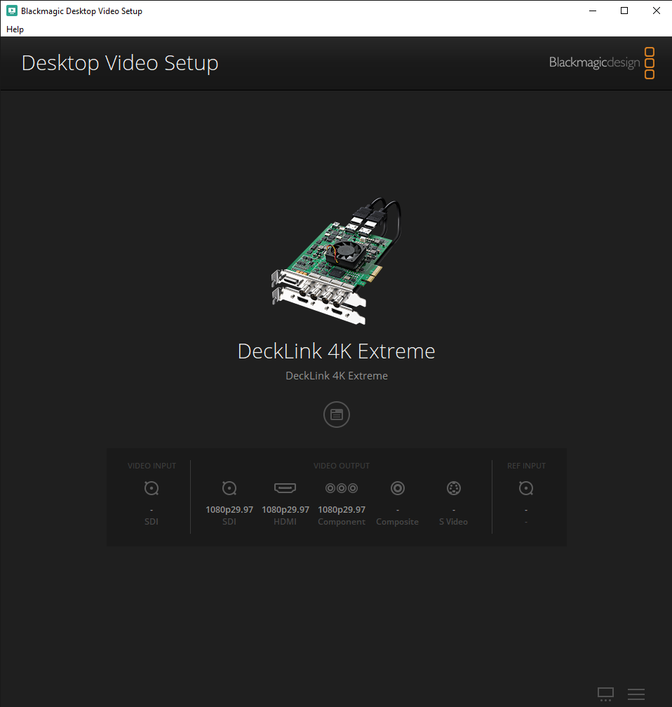
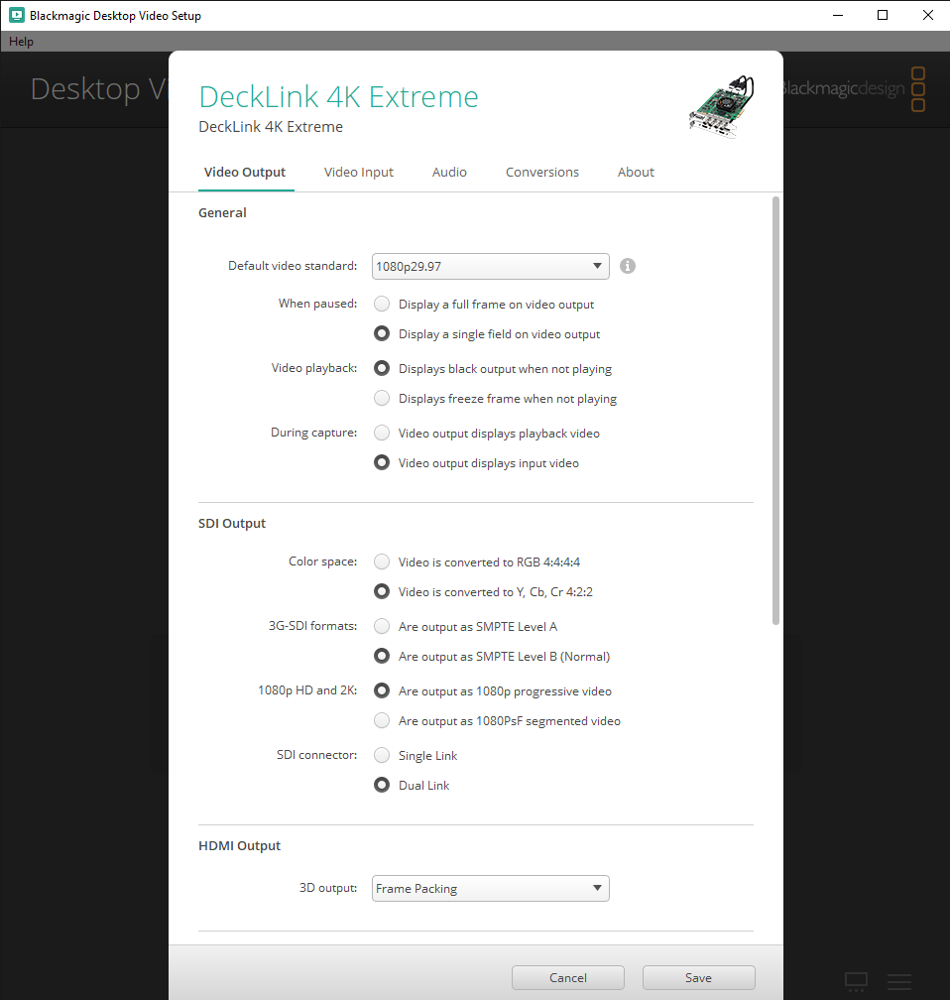
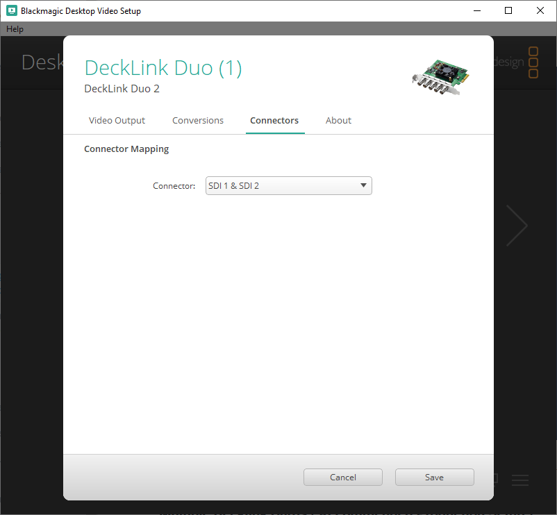

# Installing CasparCG Server for Sofie

Although CasparCG is an open source program that is free to use for both personal and cooperate applications, the hardware needed to create and execute high quality graphics is not. You can get a preview running without any additional hardware but, it is not recommended to use CasparCG for production in this manner. To begin, you will install the CasparCG Server on your machine then add the additional configuration needed for your setup of choice. 

## Installing the CasparCG Server

To begin,  download the latest release of [CasparCG Server from GitHub](https://github.com/nrkno/tv-automation-casparcg-server/releases). There are multiple versions of CasparCG available to the public for download but, you specifically want the latest NRK version. 

Once downloaded, extract the files and navigate down the folders, _CasparCG Server_ then _Server_. This folder contains your CasparCG Configuration file, `casparcg.config`, and your CasparCG executable, `casparcg.exe`. 

How you will configure the CasparCG server will depend on the number of Decklink cards your machine contains. The first subsection for each CasparCG setup, labeled _Channels_, will contain the unique portion of the configuration. The following is the majority of the configuration file that will be consistent between setups.

```markup
<?xml version="1.0" encoding="utf-8"?>
<configuration>
  <log-level>debug</log-level>
  <thumbnails>
    <generate-thumbnails>false</generate-thumbnails>
  </thumbnails>
  <!-- Paths to the Server Media -->
  <!-- Currently set to the same folder as this file -->
  <paths>
    <media-path>media/</media-path>
    <log-path>log/</log-path>
    <data-path>data/</data-path>
    <template-path>template/</template-path>
    <thumbnail-path>thumbnail/</thumbnail-path>
    <font-path>font/</font-path>
  </paths>
  <lock-clear-phrase>secret</lock-clear-phrase>
  <channels>
    <!-- Unique portion of the configuration -->
  </channels>
  <controllers>
    <tcp>
      <port>5250</port>
      <protocol>AMCP</protocol>
    </tcp>
  <tcp>
    <port>3250</port>
    <protocol>LOG</protocol>
  </tcp>
  </controllers>
</configuration>
```

 One additional note, the Server does require the configuration file be named `casparcg.config`. 

### Installing CasparCG Media Scanner

You can use the CasparCG Media Scanner to locate and add all of your media to the _Core_. To install the Media Scanner, you will go to the [project's Release page](https://github.com/nrkno/tv-automation-casparcg-launcher/releases) and download the `.zip` file under the latest release. Similar to the CasparCG Server, you want to use the NRK version. 

Once downloaded and extracted, move the `scanner.exe` file to the same folder as your `casparcg.exe` file. 

### Installing the CasparCG Launcher

You can launch both of your CasparCG applications with the[ CasparCG Launcher.](https://github.com/nrkno/tv-automation-casparcg-launcher) Download the `.exe` file in the latest release and once complete, move the file to the same folder as your `casparcg.exe` file.

## Configuring Windows

### Required Software

Windows will require you install [Microsoft's Visual C++ 2015 Redistributable](https://www.microsoft.com/en-us/download/details.aspx?id=52685) to run the CasparCG Server properly. Before downloading the redistributable, please ensure it is not already installed on your system. Open your programs list and in the popup window, you can search for _C++_ in the search field. If _Visual C++ 2015_ appears, you do not need install the redistributable.

If you need to install redistributable then, navigate to [Microsoft's website](https://www.microsoft.com/en-us/download/details.aspx?id=52685) and download it from there. Once downloaded, you can run the `.exe` file and follow the prompts.

## Hardware Recommendations

Although CasparCG can be run on some lower end hardware, it is only recommended to do so for non-production uses. Below is a table of the minimum and preferred specs depending on what type of system you are using.

| System Type | Min CPU | Pref CPU | Min GPU | Pref GPU | Min Storage | Pref Storage |
| :--- | :--- | :--- | :--- | :--- | :--- | :--- |
| Development | i5 Gen 6i7 Gen 6 | GTX 1050 | GTX 1060 | GTX 1060 | NVMe SSD 500gb |  |
| Prod, 1 Card | i7 Gen 6 | i7 Gen 7 | GTX 1060 | GTX 1070 | NVMe SSD 500gb | NVMe SSD 500gb |
| Prod, 2 Cards | i9 Gen 8 | i9 Gen 10 Extreme Edition | RTX 2070 | Quadro P4000 | Dual Drives | Dual Drives |

For _dual drives_, it is recommended to use a smaller 250gb NVMe SSD for the operating system. Then a faster 1tb NVMe SSD for the CasparCG Server and media. It is also recommended to buy a drive with about 40% storage overhead. This is for SSD p~~e~~rformance reasons and Sofie will warn you about this if your drive usage exceeds 60%.

### Decklink Cards

There are a few SDI cards made by Blackmagic that are support by CasparCG. The base model, with four bi-directional input and outputs, is the [Duo 2](https://www.blackmagicdesign.com/products/decklink/techspecs/W-DLK-31). If you need additional channels, use the[ Quad 4](https://www.blackmagicdesign.com/products/decklink/techspecs/W-DLK-30) which supports eight bi-directional inputs and outputs. Be aware the BNC connections are not the standard BNC type. B&H offers [Mini BNC to BNC connecters](https://www.bhphotovideo.com/c/product/1462647-REG/canare_cal33mb018_mini_rg59_12g_sdi_4k.html). Finally, for 4k support, use the [8K Pro](https://www.blackmagicdesign.com/products/decklink/techspecs/W-DLK-34) which has four bi-directional BNC connections and one reference connection. 

Here is the Blackmagic PDF for [installing your Decklink card \( Desktop Video Device \).](https://documents.blackmagicdesign.com/UserManuals/DesktopVideoManual.pdf)

Once the card in installed in your machine, you will need to download the controller from Blackmagic's website. Navigate to [this support page](https://www.blackmagicdesign.com/support/family/capture-and-playback), it will only display Desktop Video Support, and in the _Latest Downloads_ column download the most recent version of _Desktop Video_. Before installing, save your work because Blackmagic's installers will force you to restart your machine.

Once booted back up, you should be able to launch the Desktop Video application and see your Decklink Card.



Click the icon in the center of the screen to open the setup window. Each production situation will very in frame rate and resolution so go through the settings and set what you know. Most things are set to standards based on your region so the default option will most likely be correct.



If you chose a Decklink Duo, then you will also need to set SDI connectors one and two to be your outputs.



## Hardware Specific Configurations

### Preview Only \( Basic \)

A preview only version of CasparCG does not lack any of the features of a production version. It is called a  _preview only_ version because the standard outputs on a computer, without a Decklink card, do not meet the requirements of a high quality broadcast graphics machine. It is perfectly suitable for development though.

#### Required Hardware

No additional hardware is required, just the computer you have been using to follow this guide.

#### Configuration

The default configuration will give you one preview window. No additional changes need to be made.

### Single Decklink Card \( Production Minimum \)

#### Required Hardware

To be production ready, you will need to output an SDI or HDMI signal from your production machine. CasparCG supports Blackmagic Decklink card because they provide a key generator which will aid in keeping the alpha and fill channels of your graphics in sync. Please review the [Decklink Cards](casparcg-server-installation.md#decklink-cards) section of this page to choose which card will best fit your production needs. 

#### Configuration

You will need to add an additional consumer to your`caspar.config` file to output from your Decklink card. After the screen consumer, add your new Decklink consumer like so.

```markup
<channels>
  <channel>
    <video-mode>1080i5000</video-mode>
    <channel-layout>stereo</channel-layout>
    <consumers>
      <screen>
        <device>1</device>
        <windowed>true</windowed>
      </screen>
      <system-audio></system-audio>
      <!-- New Decklink Consumer Start -->
      <decklink>
        <device>1</device>
        <key-device>1</key-device>
        <embedded-audio>true</embedded-audio>
        <channel-layout>stereo</channel-layout>
        <latency>normal</latency>
        <keyer>external_separate_device</keyer>
        <key-only>false</key-only>
        <buffer-depth>3</buffer-depth>
      </decklink>
      <!-- Decklink Consumer End -->
    </consumers>
  </channel>
</channels>
```

You may no longer need the screen consumer. If so, you can remove it and all of it's contents. This will dramatically improve overall performance. 

### Multiple Decklink Cards \( Recommended Production Setup \)

#### Required Hardware

For a preferred production setup you want a minimum of two Decklink Duo 2 cards. This is so you can use one card to preview your media, while your second card will support the program video and audio feeds. For CasparCG to recognize both cards, you need to add two additional channels to the `caspar.config` file.

```markup
<channels>
  <channel>
    <video-mode>1080i5000</video-mode>
    <channel-layout>stereo</channel-layout>
    <consumers>
      <screen>
        <device>1</device>
        <windowed>true</windowed>
      </screen>
      <system-audio></system-audio>
      <!-- New Preview Decklink Consumer Start -->
      <decklink>
        <device>1</device>
        <key-device>1</key-device>
        <embedded-audio>true</embedded-audio>
        <channel-layout>stereo</channel-layout>
        <latency>normal</latency>
        <keyer>external_separate_device</keyer>
        <key-only>false</key-only>
        <buffer-depth>3</buffer-depth>
      </decklink>
      <!-- Preview Decklink Consumer End -->
      <!-- New Program Decklink Consumer Start -->
      <decklink>
        <device>2</device>
        <key-device>2</key-device>
        <embedded-audio>true</embedded-audio>
        <channel-layout>stereo</channel-layout>
        <latency>normal</latency>
        <keyer>external_separate_device</keyer>
        <key-only>false</key-only>
        <buffer-depth>3</buffer-depth>
      </decklink>
      <!-- Program Decklink Consumer End -->
    </consumers>
  </channel>
</channels>
```

### Validating the Configuration File

Once you have setup the configuration file, you can use an online validator to check and make sure it is setup correctly. Navigate to the [CasparCG Config Validator](https://casparcg.net/validator/) and paste in your entire configuration file. If there are any errors, they will be displayed at the bottom of the page.

### Launching the Server

Launching the Server is the same for each hardware setup. This means you can run`casparcg-launcher.exe` and the server and media scanner will start. There will be two additional warning from Windows. The first is about the EXE file and can be bypassed by selecting _Advanced_ and then _Run Anyways_. The second menu will be about CasparCG attempting to access your firewall. You will need to allow access. 

A window will open and display the status for the server and scanner. You can start, stop, and/or restart the server from here if needed. An additional window should have opened as well. This is the main output of your CasparCG Server and will contain nothing but a black background for now. If you have a Decklink card installed, its output will also be black.

## Connecting Sofie to the CasparCG Server

Now that your CasparCG server is running, you can connect it to the _Sofie Core_. Navigate back to the _Settings page_ and in the menu, select the _Playout Gateway_. If the _Playout Gateway's_ status does not read _Good_, then please review the [Installing and Setting up the Playout Gateway](../installing-a-gateway/playout-gateway.md) section of this guide. 

Under the Sub Devices section, you can add a new device with the _+_ button. Then select the pencil \( edit \) icon on the new device to open the sub device's settings. Select the _Device Type_ option and choose _CasparCG_ from the drop down menu. Some additional fields will be added to the form.

The _Host_ and _Launcher Host_ fields will be _localhost_. The _Port_ will be CasparCG's TCP port responsible for handling the AMCP commands. It defaults to 5052 in the `casparcg.config` file. The _Launcher Port_ will be the CasparCG Launcher's port for handling HTTP requests. It will default to 8005 and can be changed in the _Launcher's settings page_. Once all four fields are filled out, you can click the check mark to save the device. 

In the _Attached Sub Devices_ section, you should now see the status of the CasparCG Server. You may need to restart the Playout Gateway if the status is _Bad_.

## Further Reading

* [CasparCG Server Releases](https://github.com/nrkno/tv-automation-casparcg-server/releases) on GitHub.
* [Media Scanner Releases](https://github.com/nrkno/tv-automation-casparcg-launcher/releases) on GitHub.
* [CasparCG Launcher](https://github.com/nrkno/tv-automation-casparcg-launcher) on GitHub.
* [Microsoft Visual C++ 2015 Redistributable](https://www.microsoft.com/en-us/download/details.aspx?id=52685) on Microsoft's website.
* [Blackmagic Decklink Cards](https://www.blackmagicdesign.com/products/decklink/models) on Blackmagic's website. Check the [Decklink cards](casparcg-server-installation.md#decklink-cards) section for compatibility.
* [Installing a  Decklink Card](https://documents.blackmagicdesign.com/UserManuals/DesktopVideoManual.pdf) as a PDF.
* [Desktop Video Download Page](https://www.blackmagicdesign.com/support/family/capture-and-playback) on Blackmagic's website.
* [CasparCG Configuration Validator](https://casparcg.net/validator/)

