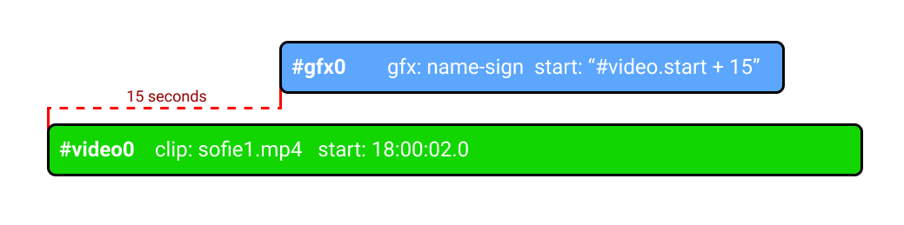

# Concepts & Architecture

## System architecture

\*\*\*\*[**Sofie Core**](dictionary.md#sofie-core) is a web-server and communicates with the web GUI.  
[Gateways](dictionary.md#gateways) are applications that are connected to Sofie Core and exchanges data; such as rundown-data for ingest or the [timeline ](dictionary.md#timeline)for play-out.

The rundown-data is fed into Sofie Core via the **Ingest Gateway** \(in this example it's a Spreadsheet Gateway, it could also be a MOS Gateway or some other ingest-type Gateway\).  
The rundown-data is then interpreted by the Blueprints and stored in the Core database.

The end user controls the show via the web-interface. A show is mainly driven by the user [Take](dictionary.md#take-point):ing the next [Part](dictionary.md#part) in the Rundown.  
Upon a Take, Sofie Core calculates what's going to be played, in the form of a new [timeline](dictionary.md#timeline) and sends it to Playout Gateway.

Read more: [Timeline](concepts-and-architecture.md#timeline)

## Blueprints

See also [Dictionary: Blueprints](dictionary.md#blueprints)

Blueprints are plug-ins that run in Sofie Core. They interpret the data coming in from the rundowns and transform them into a rich set of playable elements \(Segments, Parts, AdLibs etc\).

The blueprints are custom-made and changes depending on the show style, type of input data and the types of controlled devices. A generic [blueprint based on spreadsheets is available here](https://github.com/SuperFlyTV/sofie-blueprints-spreadsheet).

The blueprints are webpacked javascript bundles which is uploaded into Sofie via the GUI.

When [Sofie Core](dictionary.md#sofie-core) calls upon a Blueprint, it returns an js-object containing methods callable by Sofie Core. These methods will be called by Sofie Core in different situations, depending on the method.  
Documentation on these interfaces are available in the typings-library [Blueprints integration](https://www.npmjs.com/package/tv-automation-sofie-blueprints-integration).

### **System Blueprints**

Handle things on the _System level_.  
Documentation on the interface to be exposed by the Blueprint:  
[https://github.com/nrkno/tv-automation-sofie-blueprints-integration/blob/master/src/api.ts\#L52](https://github.com/nrkno/tv-automation-sofie-blueprints-integration/blob/master/src/api.ts#L52)

### **Studio Blueprints**

Handle things on the _Studio level_, like "which showstyle to use for this rundown".  
Documentation on the interface to be exposed by the Blueprint:  
[https://github.com/nrkno/tv-automation-sofie-blueprints-integration/blob/master/src/api.ts\#L57](https://github.com/nrkno/tv-automation-sofie-blueprints-integration/blob/master/src/api.ts#L57)

### **Showstyle Blueprints**

Handle things on the _Showstyle level_, like generating [_Baseline_](dictionary.md#baseline), _Segments_, _Parts, Pieces_ and _Timelines_ in a rundown.  
Documentation on the interface to be exposed by the Blueprint:  
[https://github.com/nrkno/tv-automation-sofie-blueprints-integration/blob/master/src/api.ts\#L72](https://github.com/nrkno/tv-automation-sofie-blueprints-integration/blob/master/src/api.ts#L72)

## Timeline

### What is the timeline?

The Timeline is a collection of timeline-objects, that together form a "target state", ie an intent on what is to be played and at what times.

The timeline-objects can be programmed to contain relative references to each other, so programming things like _"play this thing right after this other thing"_  is as easy as `{start: { #otherThing.end }}` 

The [Playout Gateway](libraries.md#gateways) picks up the timeline from Sofie Core and \(using the [timeline-state-resolver](https://github.com/nrkno/tv-automation-state-timeline-resolver)\) controls the play-out devices to make sure that they actually play what is intended.

### Why a timeline?

The Sofie system is made to work with a modern web- and IT-based approach in mind. Therefore, the Sofie Core can be run either on-site, or in an off-site cloud.

One drawback of running in a cloud over the public internet is the sometimes unpredictable latency. The Timeline overcomes this by moving all the immediate control of the play-out devices to the Playout Gateway, which is intended to run on a local network, close to the hardware it controls.  
This also gives the system a simple way of load-balancing - since the number of web-clients or load on Sofie Core won't affect the play-out.

Another benefit of basing the play-out on a timeline is that when programming the show \(the blueprints\), you only have to care about "what you want to happen", you don't have to care about cleaning up previously played things, or what was actually played out before. Those are things that are handled by the Playout Gateway automatically. This also allows the user to jump around in a rundown freely, without the risk of things going wrong on air.

### How does it work?


Fun tip! The timeline in itself is a [separate library available on github](https://github.com/SuperFlyTV/supertimeline).

You can play around with the timeline in the browser using [JSFiddle and the timeline-visualizer](https://jsfiddle.net/nytamin/rztp517u/)!


The Timeline is stored by Sofie Core in a MongoDB collection. It is generated whenever a user does a [TAKE](dictionary.md#take-point), changes the [Next-point](dictionary.md#next-point-and-lookahead) or anything else that might affect the play-out.

[Sofie Core](dictionary.md#sofie-core) generates the timeline using:

* The [Studio Baseline](dictionary.md#baseline) \(only if no rundown is currently active\)
* The [Showstyle Baseline](dictionary.md#baseline), of the currently active rundown.
* The [currently playing Part](dictionary.md#take-point)
* The [Next:ed Part](dictionary.md#next-point-and-lookahead) and Parts that come after it \(the [Lookahead](dictionary.md#lookahead)\)
* Any [AdLibs ](dictionary.md#adlib-pieces)the user has manually selected to play

The [**Playout Gateway**](libraries.md#gateways) then picks up the new timeline, and pipes it into the [timeline-state-resolver](https://github.com/nrkno/tv-automation-state-timeline-resolver)-library \(TSR\).

The TSR then...

* Resolves the timeline, using the [timeline-library](https://github.com/SuperFlyTV/supertimeline)
* Calculates new target-states for each relevant point in time
* Maps the target-state to each play-out device.
* Compares the target-states for each device with the currently-tracked-state and..
* ..generates commands to send to each device to account for the change.
* The commands are then put on queue and sent to the devices at the correct time.


For more information about what play-out devices the TSR supports, and examples of the timeline-objects, see the [README of TSR](https://github.com/nrkno/tv-automation-state-timeline-resolver#timeline-state-resolver)



For more information about how to program timeline-objects, see the [README of the timeline-library](https://github.com/SuperFlyTV/supertimeline#superfly-timeline)


