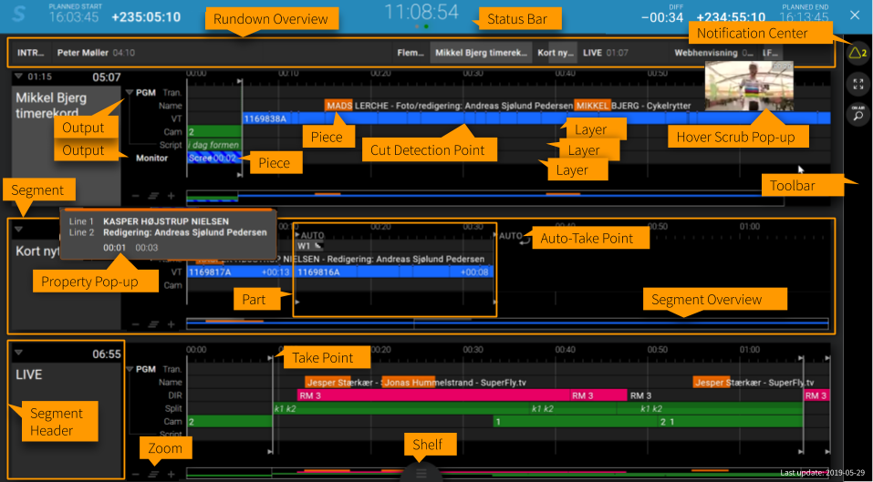
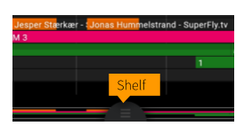

# Dictionary

### Sofie Core

The main application in the Sofie system.  
It is a web-server and serves the Web-GUI.  
It is a [NodeJS](https://nodejs.org) process backed up by a [MongoDB](https://www.mongodb.com/) database and based on the framework [Meteor](http://meteor.com).  
Read more: [_System architecture_](concepts-and-architecture.md#system-architecture)_,_ [_Getting Started_](../getting-started/)\_\_

### Gateways

Gateways are NodeJS processes that connect to Sofie Core and provide different kinds of functionality.  
Examples of Gateways are the [MOS Gateway](https://github.com/nrkno/tv-automation-mos-gateway), the [Spreadsheet Gateway](https://github.com/SuperFlyTV/spreadsheet-gateway) and the [Playout Gateway](https://github.com/nrkno/tv-automation-playout-gateway).  
All gateways use the [Core-integration library](https://github.com/nrkno/tv-automation-server-core-integration) to communicate with Core.  
Read more: [_System architecture_](concepts-and-architecture.md#system-architecture)\_\_

### Blueprints

Blueprints are plug-ins that run in Sofie Core. They interpret the data coming in from the rundowns and transform them into a rich set of playable elements \(Segments, Parts, AdLibs etc\).

The blueprints are webpacked javascript bundles which is uploaded into Sofie via the GUI.

There are 3 types of Blueprints, and all 3 must be uploaded into Sofie before the system works.

* **System Blueprints** Handle things on the _System level_
* **Studio Blueprints** Handle things on the _Studio level_, like "which showstyle to use for this rundown"
* **Showstyle Blueprints** Handle things on the _Showstyle level_, like generating _Segments_, _Parts_ and _Timelines_ in a rundown.

The blueprints are custom-made and changes depending on the show style, type of input data and the controlled devices. A generic [blueprint for rundowns based on spreadsheets is available here](https://github.com/SuperFlyTV/sofie-blueprints-spreadsheet).

Read more: [_System architecture_](concepts-and-architecture.md#system-architecture)\_\_

## Playing Things

### Take Point

The Take point is currently playing [Part](dictionary.md#part) in the rundown, indicated by the "On Air" line in the GUI.  
What's played on air is calculated from the timeline objects in the Pieces in the currently playing part.


You can TAKE the next [Part](dictionary.md#part) by pressing F12 or the rightmost Enter key.


### Next Point

The Next point is the next queued Part in the rundown. When the user clicks _Take_, the Next Part becomes the currently playing part, and the Next point is also moved.


Change the Next point by right-clicking in the GUI, or by pressing \(shift+\) F9 & F10.


### Lookahead

Elements in the [Next point ](dictionary.md#next-point)\(or beyond\) might be pre-loaded or "put on preview", depending on the blueprints and play-out devices used. This feature is called "Lookahead".

## Sofie Setup

### System

The _System_ settings are settings for this installation of Sofie. In here goes the settings that are applicable system-wide.

### Studio

A _Studio_ in Sofie-terms is a physical location, with a specific set of devices and equipment. Only one show can be on air in a studio at the same time.  
The \_studio\_ settings are settings for that specific studio, and contains settings related to hardware and play-out, such as:

* **Attached devices**; the Gateways related to this studio
* **Blueprint configuration**; ****custom config option defined by the blueprints
* **Layer Mappings**; Maps the logical _timeline layers_ to physical devices and outputs

The Studio uses a studio-blueprint, which handles things like mapping up an incoming rundown to a Showstyle.

### Showstyle

A _Showstyle_ is related to the looks and logic of a _show_, which in contrast to the _studio_ is not directly related to the hardware.  
The Showstyle contains settings like

* **Source Layers**; Groups different types of content in the GUI
* **Output Channels**; Indicates different output targets \(such as the _Program_ or _back-screen in the studio_\)
* **Blueprint configuration**; ****custom config option defined by the blueprints


Please note the difference between S_ource Layers_ and _timeline-layers:_

[Pieces ](dictionary.md#piece)are put onto _Source layers_, to group different types of content \(such as a VT or Camera\), they are therefore intended only as something to indicate to the user what is going to be played, not what is actually going to happen on the technical level.

[Timeline-objects](dictionary.md#timeline-object) \(inside of the [Pieces](dictionary.md#piece)\) are put onto timeline-layers, which are \(through the Mappings in the studio\) mapped to physical devices and outputs.  
The exact timeline-layer is never exposed to the user, but instead used on the technical level to control play-out.

An example of the difference could be when playing a VT \(that's a Source Layer\), which could involve all of the timeline-layers _video\_player0_, _audio\_fader\_video_, _audio\_fader\_host_ and _mixer\_pgm._


### Migrations

The migrations are automatic setup-scripts that help you during initial setup and system upgrades.

There are system-migrations that comes directly from the version of Sofie Core you're running, and there are also migrations added by the different blueprints.

It is mandatory to run migrations when you've upgraded Sofie Core to a new version, or upgraded your blueprints.

## Rundown

A Rundown is what starts playing when you start a show. It contains Segments and Parts, which can be selected by the user to be played out.  
A Rundown always has a [showstyle](dictionary.md#showstyle) and is played out in the context of a [Studio](dictionary.md#studio).

Only a single Rundown can be active at a time within each Studio.

### Segment

The Segment is the horizontal line in the GUI. It is intended to be used as a "chapter" or "subject" in a rundown, where each individual playable element in the Segment is called a [Part](dictionary.md#part).

### Part

The Part is the playable element inside of a [Segment](dictionary.md#segment). This is the thing that starts playing when the user does a [TAKE](dictionary.md#take-point).  
The Part in itself doesn't determine what's going to happen, that's handled by the [Pieces](dictionary.md#piece) in it.

### Piece

The Pieces inside of a Part determines what's going to happen, the could be indicating things like VT:s, cut to cameras, graphics, or what script the host is going to read.

Inside of the pieces are the [timeline-objects](dictionary.md#timeline-object) which controls the play-out on a technical level.


Tip! If you want to manually play a certain _Graphics_ piece, you can at any time double-click it in the GUI, and it will be copied and played at your play head, just like an [AdLib](dictionary.md#adlib-pieces) would!


See also: [Showstyle](dictionary.md#showstyle)

### Timeline Object

The timeline-objects are stored inside of the [Pieces](dictionary.md#piece) and they control what's going to be played out on a technical level. When a [Part](dictionary.md#part) starts playing, all the timeline-objects from it's [Pieces ](dictionary.md#piece)are added to the [Timeline](dictionary.md#timeline) and played out by the Playout Gateway.

### AdLib Pieces

The AdLib pieces are Pieces that isn't programmed to fire at a specific time, but instead intended to be manually triggered by the user.

The AdLib pieces can either come from the currently playing Part, or it could be _global AdLibs_ that are available throughout the show.

An AdLib isn't added to the Part in the GUI until it starts playing, instead you find it in the [Shelf](dictionary.md#shelf).

### Shelf

The Shelf contains the playable AdLib pieces, as well as some other non-essential information.


You can open the shelf either by clicking the handle at the bottom of the GUI, to by pressing the TAB key.


### Baseline

The Baseline is a timeline with timeline-objects that works as "fallback" during play-out. The baseline is generated by the Blueprints. There are different types of Baselines:

* **The Studio Baseline**; this is activated whenever there is no rundown active in a studio. This is used for controlling things like turning off the lights, or start the coffee-machine after a show. This is generated by the [Studio Blueprints](dictionary.md#blueprints).
* **The Rundown Baseline**; is merged together with the timeline in a running rundown. This is used for controlling things like pulling down audio faders with a nice transition, etc. This is generated by the [Showstyle Blueprints](dictionary.md#blueprints).

## Timeline

The timeline is used to control all play-out.

_Read more at_ [_Concepts and Architecture_](concepts-and-architecture.md#timeline)\_\_

